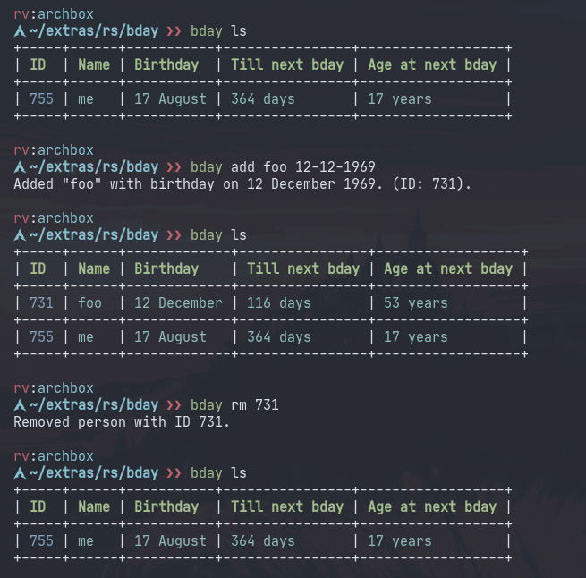

# Bday

Birthday tracker.



### Compiling

#### Arch Linux

Bday is available in the AUR ([bday-git](https://aur.archlinux.org/packages/bday-git)).

You can compile it using `cargo` or install [baker](https://github.com/rv178/baker) and compile it like this:

```
bake setup
bake
```

A binary will be copied to `./bin/bday`

### Usage

#### List everyone's birthdays

```
bday list
```

or

```
bday ls
```

#### Add a person

-   Birthday should be in `day-month-year` format. eg: `17-08-2006`

```
bday add [name] [birthday]
```

#### Remove a person

```
bday rm [id]
```
